# Guia: Stack *arr com conteúdo brasileiro

Este é um guia introdutório para quem deseja começar a explorar o universo da família **arr**, com foco em filmes e séries voltados ao público brasileiro — seja em produções nacionais em português ou em conteúdos internacionais dublados.

Neste guia, focaremos nos seguintes serviços e em suas respectivas configurações:

- Prowlarr
- Radarr
- Sonarr

Utilizaremos o [Docker](https://docs.docker.com/engine/) e o [Docker Compose](https://docs.docker.com/compose/) para executar os serviços e gerenciar toda a stack de forma prática e organizada.

O objetivo é explorar ao máximo o potencial dos trackers públicos; por isso utilizaremos o [BeTor](https://betor.top/) como indexador. O BeTor é um projeto que coleta (raspa) dados dos principais agregadores de torrent do Brasil — como BluDv, Comando, Rede Torrents e Starck Filmes.

## Prowlarr

O [Prowlarr](https://prowlarr.com/) é um indexador de torrents e usenet que atua como central de busca e integração para o Radarr, Sonarr e outros aplicativos similares, facilitando o gerenciamento e a automação de downloads.

### Configurando o container com Docker Compose

Iniciaremos criando o arquivo `docker-compose.yml`, responsável por definir e configurar todos os serviços da stack.

```yaml
services:
  prowlarr:
    image: lscr.io/linuxserver/prowlarr:latest
    ports:
      - "9696:9696"
    environment:
      - TZ=America/Sao_Paulo
    volumes:
      - prowlarr-config:/config
      - ./custom-definitions:/config/Definitions/Custom:ro

volumes:
  prowlarr-config: {}
```

Note que, nos volumes, mapeamos para que as definições customizadas de indexers (custom definitions) do Prowlarr estejam no diretório/pasta `custom-definitions`. Portanto, é necessário garantir que essa pasta exista antes de executar o container.

Crie a pasta no seu explorador de arquivos ou pelo terminal, caso esteja utilizando uma distribuição Linux ou macOS:

```sh
mkdir custom-definitions
```

Inicie o Prowlarr com o Docker Compose:

```sh
docker-compose up
# ou
docker compose up

# para rodar em segundo plano
docker-compose up -d
# ou
docker compose up -d
```

Aguarde o serviço inicializar e acesse a interface do Prowlarr pelo endereço [localhost:9696](http://localhost:9696/).

### Primeiras configurações

No primeiro acesso, o Prowlarr solicitará que você configure o método de autenticação. Recomenda-se utilizar a opção **Forms (Login Page)**.

Para este tutorial, optei por desabilitar a obrigatoriedade de autenticação para endereços locais (como localhost, 127.0.0.1, 192.xxx.xxx.xxx, etc.) e defini o nome de usuário e a senha como: *pirata/pirata*.

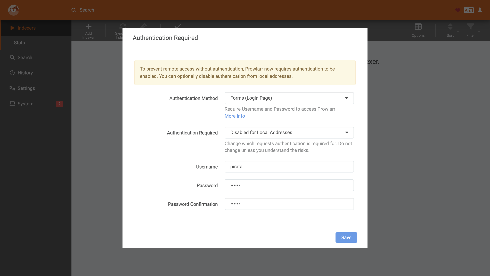

### Adicionando o Catálogo BeTor como Indexer

Na página inicial, são listados todos os Indexers adicionados. Como estamos em uma instância recém-criada e ainda não adicionamos nenhum index, um botão para adicionar um novo é exibido em destaque na página.

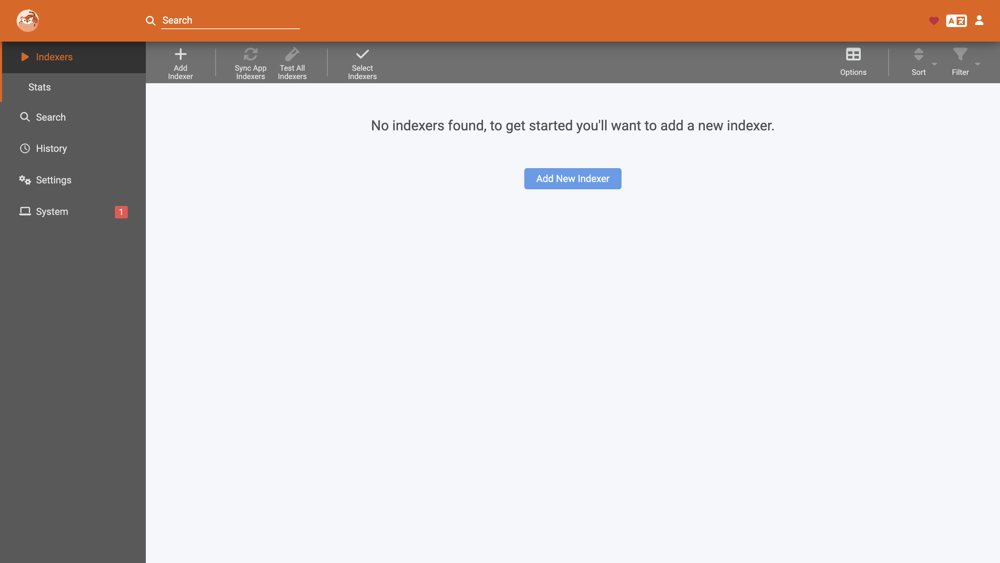

Se você clicar em **Add New Indexer** um modal irá aparecer e se realizar uma busca por *BeTor* nenhum resultado será exibido.

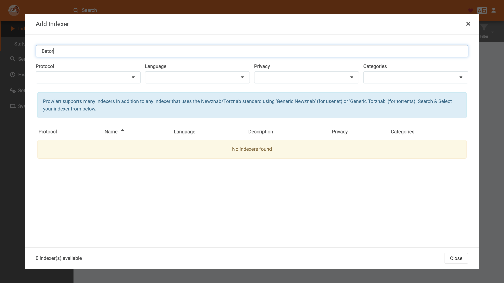

O Indexer **Catálogo BeTor** deve ser adicionado como uma custom definition. Para isso, copie o arquivo [catalogo-betor.yml](https://catalogo.betor.top/static/catalogo-betor.yml) para dentro do diretório/pasta `custom-definitions`, que foi mapeada no Docker e mencionada anteriormente neste guia.

Reinicie o Prowlarr encerrando os serviços com `Ctrl + C`, ou execute o comando abaixo caso ele esteja sendo executado em segundo plano:

```sh
docker-compose down
# ou
docker compose down
```

Basta executar novamente os serviços e aguardar o Prowlarr inicializar:

```sh
docker-compose up
# ou
docker compose up

# para rodar em segundo plano
docker-compose up -d
# ou
docker compose up -d
```

Ao reiniciar o Prowlarr e buscar novamente por BeTor, o indexador **Catálogo BeTor** estará disponível.

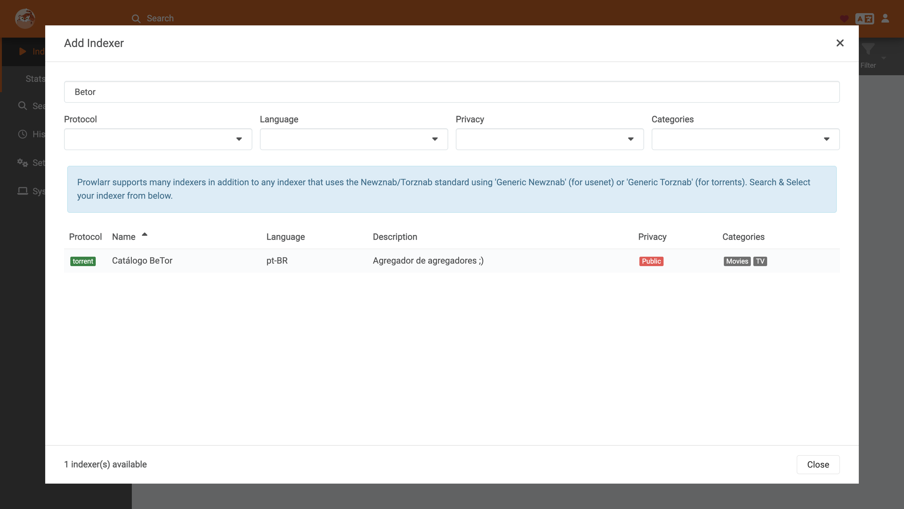

Clique em **Catálogo BeTor** para abrir o modal de configuração. Em seguida, clique em **Test** para verificar a conectividade com o indexador e depois em **Save** para salvar as configurações.

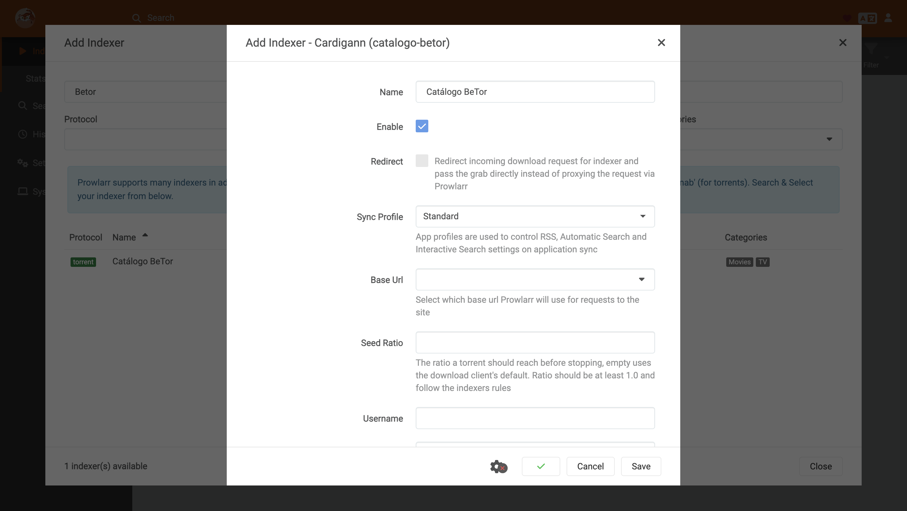

Ao fechar o modal de busca de indexadores, você volta à listagem principal, onde o **Catálogo BeTor** já estará disponível.

A partir de agora, você já pode realizar buscas diretamente no Prowlarr e integrá-lo com outros serviços, como o Sonarr e o Radarr.

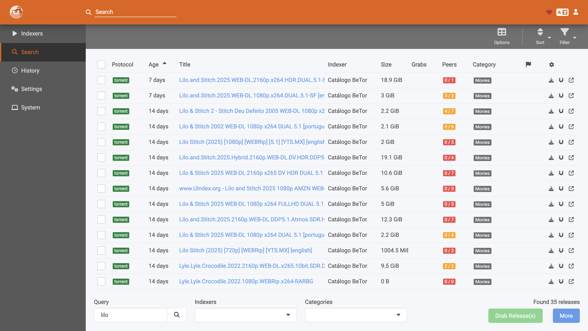

## Radarr

O [Radarr](https://radarr.video/) é uma ferramenta que automatiza o download, organização e gerenciamento de filmes, integrando-se a indexadores e clientes de torrent ou usenet.

### Configurando o container com Docker Compose

Para adicionar o **Radarr** à stack, basta incluir o serviço e o volume correspondentes no arquivo `docker-compose.yml`.

```yml
services:
  prowlarr:
    ...

  # Adicione esse bloco
  radarr:
    image: lscr.io/linuxserver/radarr:latest
    ports:
      - "7878:7878"
    environment:
      - TZ=America/Sao_Paulo
    volumes:
      - radarr-config:/config

volumes:
  ...
  # Lembre de adicionar o volume também
  radarr-config: {}

```

Inicie o Radarr executando novamente a stack com Docker Compose:

```sh
docker-compose up
# ou
docker compose up
```

Aguarde o serviço inicializar e acesse a interface web do Radarr pelo endereço [http://localhost:7878](http://localhost:7878/).

### Primeiras configurações

No primeiro acesso, o Radarr solicitará que você configure o método de autenticação, de forma semelhante ao Prowlarr. Recomenda-se utilizar a opção **Forms (Login Page)**.

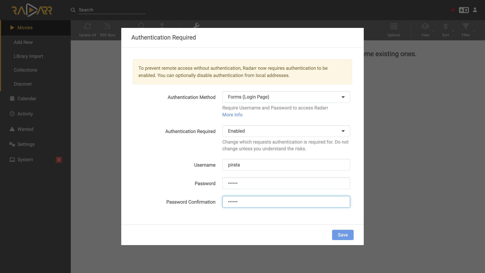

Após salvar, você será direcionado à tela inicial, onde será exibida a listagem de filmes adicionados — que, neste primeiro acesso, estará vazia, mostrando um botão em destaque para adicionar o primeiro filme.

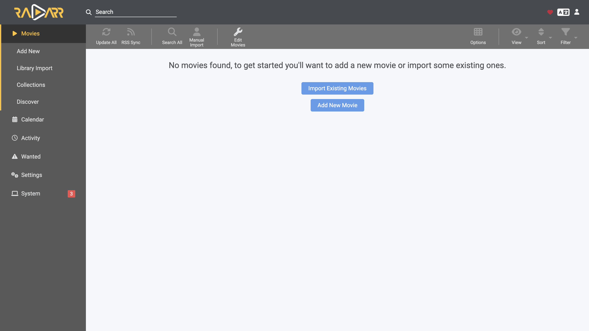

### Configurando o cliente Torrent

O **Radarr** não é um cliente de torrent — para realizar os downloads, é necessário integrá-lo a um cliente compatível.

Navegue pela barra lateral até *Settings → Download Clients*.

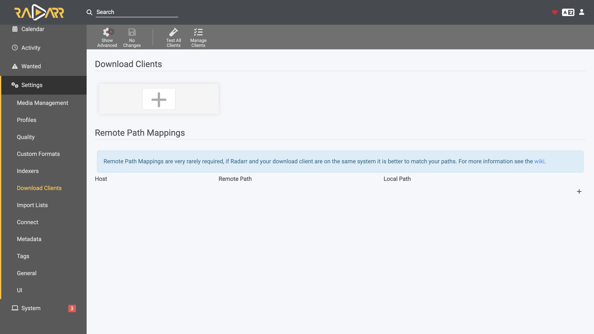

Clique em *“+”* para visualizar a lista de clientes suportados e configure aquele que você utiliza.

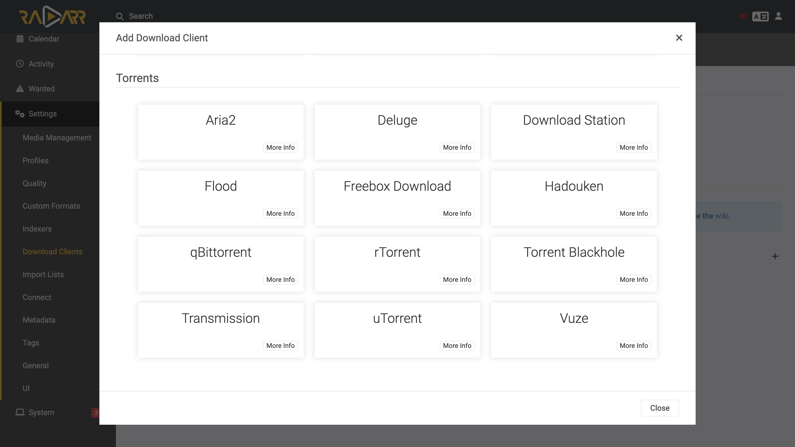

### Conectando o Radarr e Prowlarr

A configuração mais importante no **Radarr** é a dos **indexers**. No entanto, vamos delegar essa função ao **Prowlarr**, que será o nosso gerenciador central de indexers.

Agora, volte ao **Prowlarr** em [localhost:9696](http://localhost:9696/) e navegue pela barra lateral até *Settings >> Apps*.

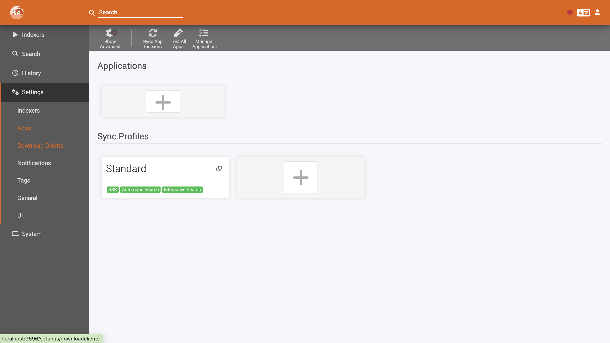

Clique em *“+”* e, em seguida, selecione **Radarr**.

Para configurar o Radarr, preencha os campos da seguinte forma:

- **Prowlarr Server:** `http://prowlarr:9696`
- **Radarr Server:** `http://radarr:7878`

> ⚠️ **Atenção:** Esses endereços são válidos apenas no contexto deste guia, utilizando o Docker Compose.

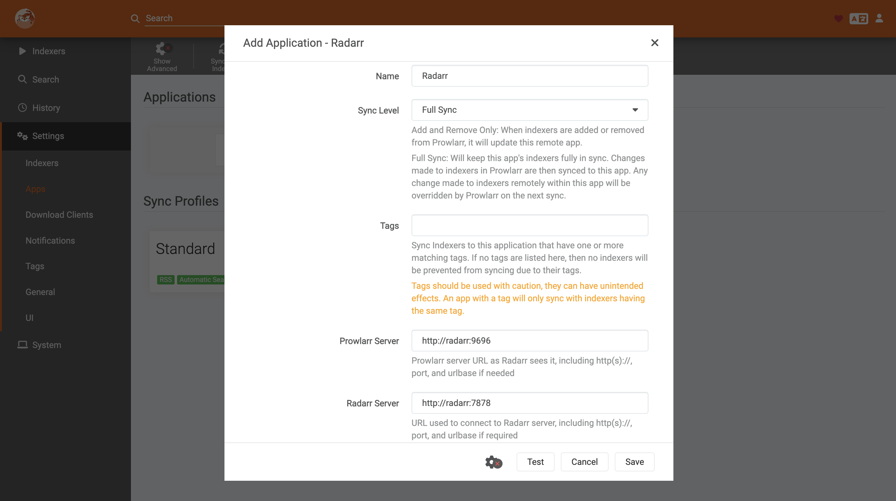

Note que, para finalizar a configuração, é obrigatório informar o campo **API Key**.

Essa chave pode ser encontrada no próprio Radarr: acesse [localhost:7878](http://localhost:7878/), navegue até *Settings >> General*, e na seção **Security** você verá a chave de API.

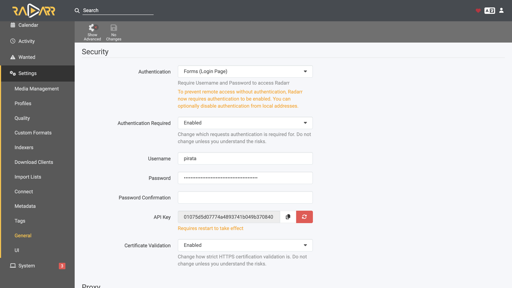

Copie a chave e cole no campo correspondente no Prowlarr.

Em seguida, clique em *Test* e depois em *Save*.

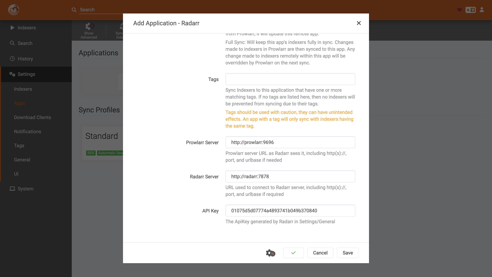

Por fim, clique em *Sync App Indexers* na barra superior para que o Prowlarr adicione automaticamente seus indexers ao Radarr.

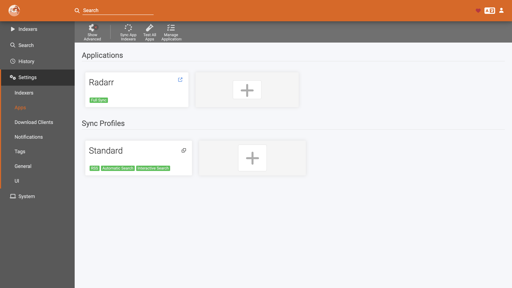

Voltando ao **Radarr** em [localhost:7878](http://localhost:7878/), navegue pela barra lateral até *Settings >> Indexers*.

Agora, você verá o **Catálogo BeTor** listado como um dos indexers disponíveis.

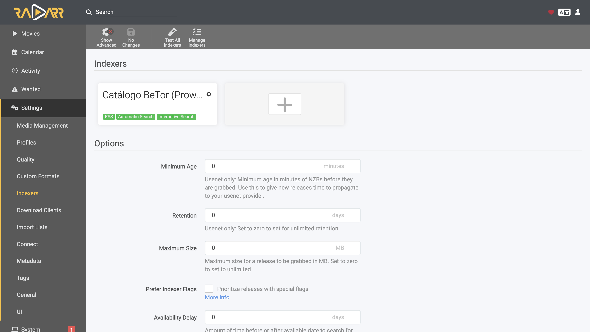
